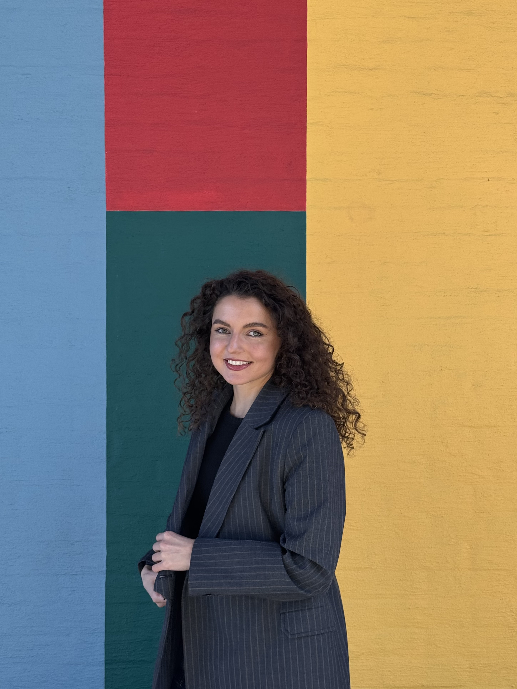

Hello! My name is Louisa Boulaziz and I am a PhD Fellow at the [ARENA Centre for European Studies](https://www.sv.uio.no/arena/english/) at the University of Oslo.

My research focuses on gender representation, judicial politics and legal mobilization. My research has been awarded the best law and courts paper at ECPR in 2023 and has also received an honorary mention for best conference paper at EUSA in 2024. I have a solo-authored paper accepted for publication in The Journal of Politics and co-authored work published in The British Journal of Political Science. 

I am on the job-market this year.

Please contact me at [louisabo@uio.no](mailto:louisabo@uio.no).

